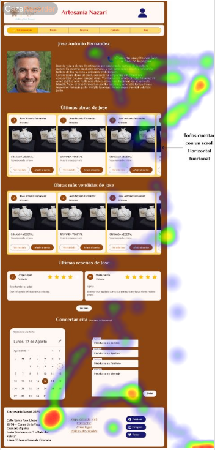
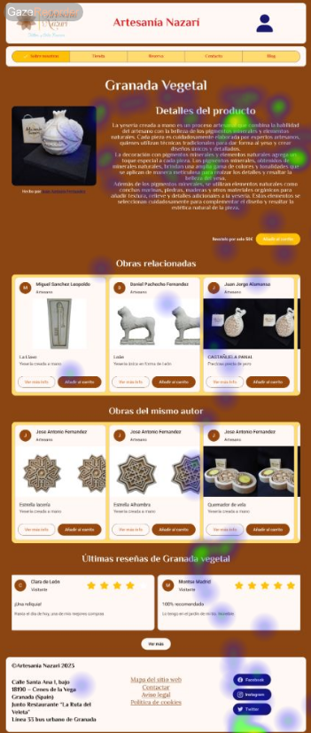
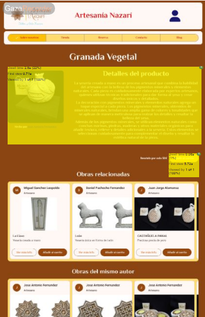

## Paso 5. Evaluación mediante Eye Tracking 

)  5.a Eye Tracking method 

5.a) Diseño del experimento 
----
Para el experimento vamos a usar Gaze Recorder, la herramienta recomendada en el guion de prácticas, para ello, vamos a analizar 4 páginas de nuestro sitio:
1-Home
2-NombreArtesano
3-Producto
4-Tienda
Con respecto a los usuarios, hemos conseguido que los usuarios reclutados en la práctica 4
### Objetivos establecidos para el test a los usuarios: 

- Cristóbal: Echar un vistazo genérico al Home.
- Mari Carmen: Intentar contactar con un Artesano.
- Manoli: Echar un vistazo a la página relativa a un producto e intentar Añadirlo al carrito.
- Juan: Añadir al carrito algún producto de la Tienda.

5.b) Resultados y valoración 

En conclusión, como hemos podido observar en las pruebas realizadas con eye tracking, el resultado ha sido positivo, nuestros usuarios han demostrado que pueden interactuar de manera positiva con nuestra interfaz. Hemos podido confirmar que los elementos están distribuidos correctamente y que la web no tiene distracciones innecesarias.
