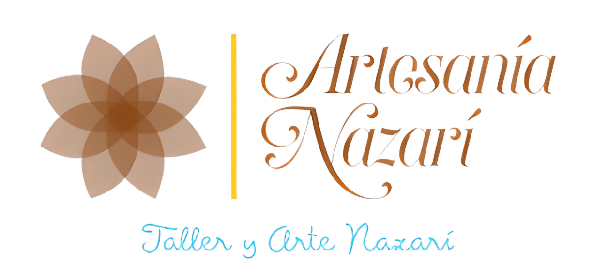
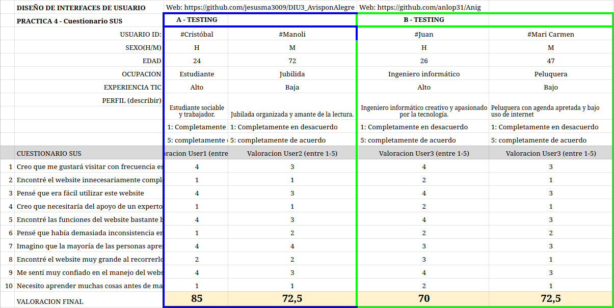
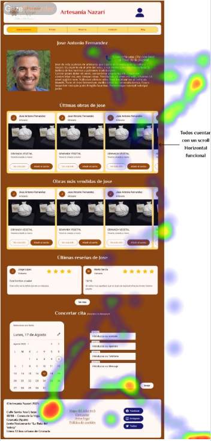
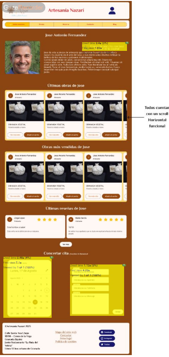
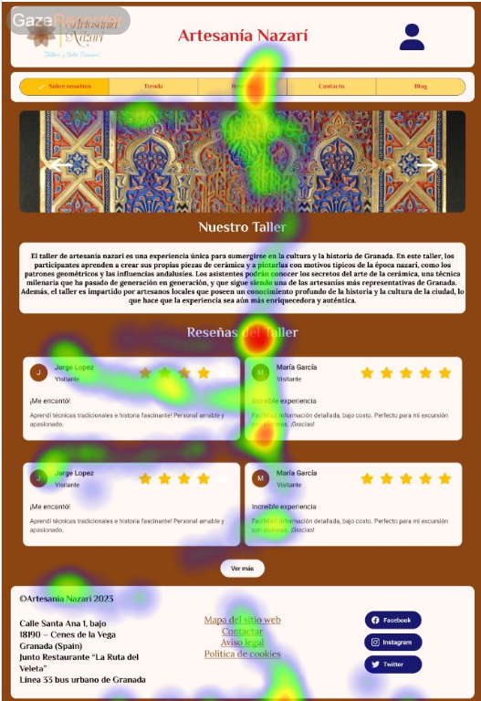
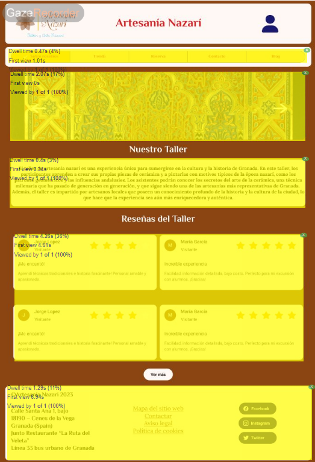
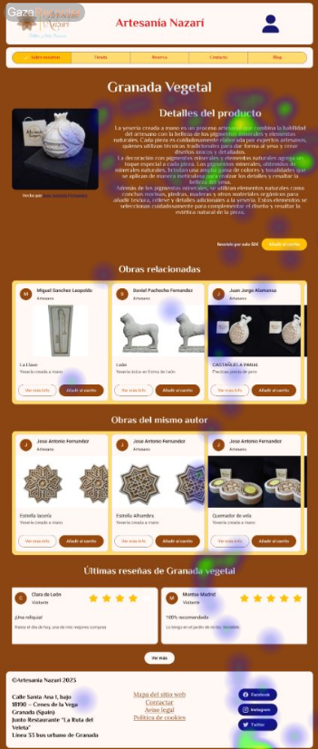
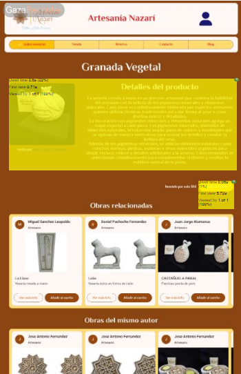
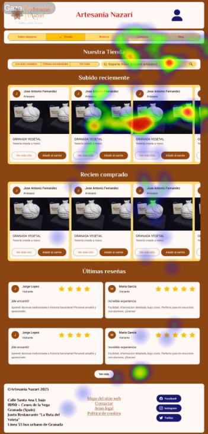
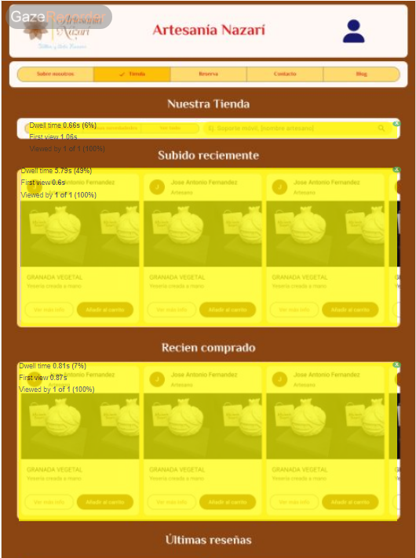

# DIU23
Prácticas Diseño Interfaces de Usuario 2022-23 (Tema: .... )

Grupo: DIU1_01A1.  Curso: 2022/23
Updated: 11/1/2023

Proyecto:
Rediseño de la web artesania nazarie

Descripción:

Nuestro proyecto consiste en mejorar la página web de turismo de nuestro taller de artesanía nazarí, con el objetivo de ofrecer una experiencia completa a nuestros visitantes. Para ello, nuestra propuesta consiste en implementar un catálogo más detallado de nuestros productos e información de nuestros artesanos junto con métodos para contactar con estos, con el fin de conseguir la asistencia deseada y fomentar la conexión entre nuestros visitantes y nuestro trabajo artesanal intetando alcanzar un mayor grado de satisfacción de estos y ampliar el número de usuarios cuyas necesidades se abarcan.

Miembros
 * Jesús Marín Almansa
 * Rafael Calvo Córdoba

-----
## Indice
- [DIU23](#diu23)
- [Proceso de Diseño](#proceso-de-diseño)
  * [Paso 1. UX Desk Research & Analisis](#paso-1-ux-desk-research-analisis)
    + [Jorge](#jorge)
    + [María](#maría)
    + [Jorge](#jorge-1)
    + [María](#maría-1)
  * [Paso 2. UX Design](#paso-2-ux-design)
  * [Paso 3. Mi UX-Case Study (diseño)](#paso-3-mi-ux-case-study-diseño)
    + [Página de inicio](#página-de-inicio)
    + [Página Sobre Nosotros->Nuestros Artesanos](#página-sobre-nosotros-nuestros-artesanos)
    + [Página Sobre Nosotros->Nuestros Artesanos con tarjeta superpuesta](#página-sobre-nosotros-nuestros-artesanos-con-tarjeta-superpuesta)
    + [Página de un artesano](#página-de-un-artesano)
    + [Página de la tienda](#página-de-la-tienda)
    + [Página de la tienda con tarjeta de producto superpuesta](#página-de-la-tienda-con-tarjeta-de-producto-superpuesta)
    + [Página de un producto](#página-de-un-producto)

# Proceso de Diseño

## Paso 1. UX Desk Research & Analisis

 1.a Competitive Analysis
-----

Hemos decidido comparar las 3 webs asignadas en el guión de prácticas ya que todas tienen el mismo objetivo de facilitar rutas turí sticas y es de utilidad comprobar los puntos débiles y fuertes de cada una para ver que podríamos mejorar en cada una de ellas. * A cual q uier tipo de usuario (personas con discapacidad auditiva...)

 1.b Persona
-----
Hemos inventado dos personajes imaginarios provenientes de distintos contextos. Ambos tienen que utilizar la web en cuestión, pero cada uno de ellos posee necesidades y requisitos particulares.
### Jorge

### María

 1.c User Journey Map
----

### Jorge

### María

Jorge busca información para visitar Granada, mientras que un profesora abusca organizar una excursión educativa de bajo costo. Estas dos experiencias de usuario son bastante habituales, ya que representan dos perfiles comunes al utilizar una aplicación para organizar una visita o excursión.

 1.d Usability Review
----

- Enlace al documento: [click aquí](P1/5.%20Usability%20Review%20y%20briefing/Usability-review.xlsx)
- Valoración final (numérica): 67 puntos
En general, el sitio web tiene algunos fallos en la experiencia de navegación. También presenta problemas de usabilidad que afectan a la efectividad y satisfacción de los usuarios. Algunos de estos problemas son: falta de adaptación al tamaño de pantalla, diseño poco atractivo y confuso, navegación poco intuitiva. Estos problemas podrían solucionarse aplicando los principios y las mejores prácticas del diseño UX/UI. Además, los contenidos multimedia no están adaptados para la navegación en dispositivos de escritorio.

## Paso 2. UX Design

 2.a POV
----

>>> Comenta con un diagrama los aspectos más destacados a modo de conclusion de la práctica anterior,

[Diagrama POV](P2/1.%20Ideación:%20POV%20e%20Insights/Point%20Of%20View.pdf)

Hemos pensado en realizar una conexión directa con artesanos locales, información detallada sobre productos, reservas fáciles y seguras, reseñas y comentarios verificados para generar confianza.

 2.b ScopeCanvas
----
/Scope%20Canvas%20(Community)-1.png)

 2.b Tasks analysis
-----

 2.c IA: Sitemap + Labelling
----

|Tareas / Perfiles de Usuario|Turismo General|Visitas Grupales (como Colegios)|Business to Business|Locales(otros)|
|:----|:----|:----|:----|:----|
|Buscar información sobre los productos disponibles|Media|Media|Alta|Media|
|Consultar información sobre los artesanos|Baja|Alta|Alta|Baja|
|Ver precios de los productos|Media|Media|Alta|Media|
|Realizar una reserva para una visita al taller|Alta|Alta|Media|Media|
|Contactar con los artesanos para hacer preguntas o solicitar información adicional|Baja|Media|Alta|Baja|
|Conocer la ubicación del taller y la forma de llegar|Alta|Alta|Alta|Alta|
|Ver fotos y vídeos de los productos y el taller|Media|Alta|Alta|Media|
|Leer comentarios y reseñas de otros clientes|Alta|Alta|Alta|Media|
|Dejar comentarios y reseñas sobre la experiencia de productos y el taller|Alta|Alta|Alta|Media|
|Conocer los horarios de apertura y cierre|Alta|Alta|Alta|Alta|
|Descargar catálogos o folletos de los productos|Media|Media|Alta|Baja|
|Conocer las políticas de devolución y garantía|Media|Baja|Alta|Baja|
|Conocer la historia y la filosofía del taller|Media|Alta|Baja|Baja|
|Realizar compras en línea|Baja|Media|Alta|Baja|
|Ver información sobre eventos y talleres especiales |Baja|Alta|Baja|Media|
|Hacer una reserva para un evento o taller especial |Baja|Alta|Baja|Media|
|Conocer las opciones de transporte para llegar al taller|Alta|Media|Alta|Baja|
|Conocer los lugares turísticos cercanos al taller|Alta|Alta|Baja|Baja|
|Conocer los lugares de ocio cercanos al taller|Alta|Alta|Baja|Baja|

 2.d Wireframes
-----

## Paso 3. Mi UX-Case Study (diseño)

 3.a Moodboard
-----

  3.b Landing Page
----

 3.c Guidelines
----

  3.d Mockup
----
### Página de inicio

### Página Sobre Nosotros->Nuestros Artesanos

### Página Sobre Nosotros->Nuestros Artesanos con tarjeta superpuesta

### Página de un artesano

### Página de la tienda

### Página de la tienda con tarjeta de producto superpuesta

### Página de un producto

También nuestro diseño es responsive, puedes encontrar más imagenes [aquí](P3/4.%20Layout%20HI-FI/)
## Paso 4. Evaluación

 4.a Caso asignado
----

El propósito de la página web "Conociendo Granada" es ofrecer tours de distintos tipos (gratuitos, de pago, privados) para que los usuarios puedan conocer los diferentes lugares de interés en la provincia de Granada, incluyendo la ciudad, la montaña y la costa.
La página busca incentivar a los clientes a visitarla mediante la creación y envío de ofertas temporales a través de un sistema de suscripción. El objetivo principal es proporcionar a los usuarios una experiencia turística completa y atractiva en Granada. 

Link a la [web](https://github.com/anlop31/Anig/tree/master/P3).

 4.b User Testing
----
Para las personas hemos usado los datos proporcionados en el guión de la práctica.
Respecto al género, ocupación, experiencia y plataforma hemos adaptado el resultado de los dados a familiares que se ajustaba a los resultados.

|#id. usuario|Sexo/edad|Ocupación|Rol/Perfil(goals)|Experiencia internet|Plataforma|Conocimiento|
|:----|:----|:----|:----|:----|:----|:----|
|Cristóbal(1)|H/24|Estudiante|Sociable/Trabajador/Alegre|Avanzado|Mac|Alta|
|Manoli(2)|M/72|Jubilada|Organizada/Amante de la lectura|Baja|Windows|Baja|
|Juan(3)|H/26|Ingeniero informático|Creativo/Innovador|Alto|Linux|Media|
|Mari Carmen(4)|M/47|Peluquera|Familiar/Tiempo ajustado/Triste|Bajo|Windows|Bajo|

. 4.c Cuestionario SUS
----

 4.d Usability Report
----

En el caso B nos encontramos también unas puntuaciones similares aunque algo más bajas que en el test A. Esto se puede deber a algunas inconsistencias visuales en la web. En el caso específico de Juan, es curioso que un usuario experto haya dado una puntuación ligeramente más baja, creemos que es porque se fija más en detalles como el balanceo de la página web y las proporciones de la página. Igualmente, la web es aceptable tipo B.

## Paso 5. Evaluación mediante Eye Tracking 

)  5.a Eye Tracking method 

5.a) Diseño del experimento 
----
Para el experimento vamos a usar Gaze Recorder, la herramienta recomendada en el guion de prácticas, para ello, vamos a analizar 4 páginas de nuestro sitio:
1-Home
2-NombreArtesano
3-Producto
4-Tienda
Con respecto a los usuarios, hemos conseguido que los usuarios reclutados en la práctica 4
### Objetivos establecidos para el test a los usuarios: 

- Cristóbal: Echar un vistazo genérico al Home.
- Mari Carmen: Intentar contactar con un Artesano.
- Manoli: Echar un vistazo a la página relativa a un producto e intentar Añadirlo al carrito.
- Juan: Añadir al carrito algún producto de la Tienda.

5.b) Resultados y valoración 

En conclusión, como hemos podido observar en las pruebas realizadas con eye tracking, el resultado ha sido positivo, nuestros usuarios han demostrado que pueden interactuar de manera positiva con nuestra interfaz. Hemos podido confirmar que los elementos están distribuidos correctamente y que la web no tiene distracciones innecesarias.

## Conclusión final / Valoración de las prácticas

Gracias al desarrollo de diseño de la metodología UX hemos aprendido la necesidad de enfocarnos en la experiencia del usuario. En general, la mayoría de los resultados obtenidos en los test ha sido positiva y hemos conseguido crear una solución que mejora la experiencia del usuario frente a la de https://artesanianazari.es. 
Si bien es cierto que algunas nos ha llevado más tiempo del que disponemos o el que nos habría gustado poder dedicar, nos han resultado unas prácticas entretenidas en las que hemos aprendido bastante
